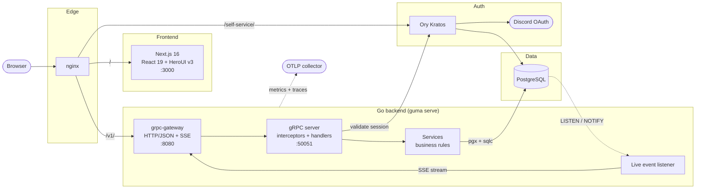

# Guma

Guma is a guild management app for MMORPG guilds: roll calls, loot
distribution, auctions, raffles, a guild currency economy, a boss calendar, and
announcements.


**[Live demo](https://kia280.github.io/guma/)**

## Background

Guma started as a tool for running a guild in a Korean MMORPG. Officers had to
track who joined each boss fight, split the loot and gold fairly, run auctions
and raffles, and keep the schedule and announcements in one place. Guma brings
those everyday guild operations into a single app.

It is also my practice project for building a web-based cloud service end to
end: a Go gRPC backend, a Next.js frontend, PostgreSQL, Discord login through
Ory Kratos, live updates, observability, and a Helm chart for deployment. I also
use it to practice working with coding agents: agents do much of the
implementation, and I review every change before it is merged.

Many TODOs remain, and every guild runs things differently, so feel free to
fork Guma and adapt it to your guild.

## Features

- **Roll calls**: officers open a roll call for a boss or event and members check in.
- **Loot and gold distribution**: split the loot and gold pot among attendees.
- **Boss calendar**: month, week, and day views with recurring events.
- **Auctions**: members bid on items with their wallet balance.
- **Raffles**: ticketed prize draws with a spinning wheel.
- **Wallet and backpack**: each member's gold, items, and transaction history.
- **Guild vault**: shared guild funds and items with requests and contributions.
- **Admin inbox**: one queue to approve or reject requests and withdrawals.
- **Members and roles**: owner, admin, moderator, and member permissions.
- **Announcements**: Markdown announcements with drafts and pinning.
- **Live updates**: balances and events refresh over SSE.
- **Multiple languages**: English and Traditional Chinese, and more can be added.
- **Observability**: OpenTelemetry metrics and traces exported over OTLP.

## Architecture



- **Frontend** (`web/`): Next.js 16, React 19, HeroUI v3, Tailwind CSS v4, and
  `next-intl`.
- **Backend**: one Go binary (`guma serve`). gRPC handlers handle transport,
  services hold business rules, and `sqlc` queries handle data access. The API
  is defined in `proto/guma/v1/`.
- **Auth**: Ory Kratos with Discord OAuth.

## Development

Requirements: Docker, the
[Dev Container CLI](https://github.com/devcontainers/cli), and a Discord OAuth
application. Frontend-only work can use mock mode instead (see
[web/README.md](web/README.md)).

```bash
cp .devcontainer/config/kratos/kratos.yaml.example .devcontainer/config/kratos/kratos.yaml
cp config.yaml.example config.yaml
# add your Discord client ID and secret to kratos.yaml, then:
make devcontainer
```

Open <http://localhost:8081>. [docs/configuration.md](docs/configuration.md)
covers backend and frontend settings and observability.

```bash
go test ./...                       # backend tests
cd web && npm run lint              # frontend lint
cd web && npx next build --webpack  # frontend production build
make proto                          # after editing proto/guma/v1/*.proto
make sqlc                           # after editing internal/db/queries/*.sql
```

[AGENTS.md](AGENTS.md) has the repository map, conventions, migrations, and the
full command list. Deployment uses the root [dockerfile](dockerfile) and the
Helm chart in [deploy/guma](deploy/guma).

## Contributing

See [CONTRIBUTING.md](CONTRIBUTING.md).

## License

Copyright (C) 2026 K1a

Guma is licensed under the [Elastic License 2.0](LICENSE) (Elastic-2.0), a
source-available license. Guilds may use, self-host, and modify it for free,
but it may not be offered to third parties as a hosted or managed service.
