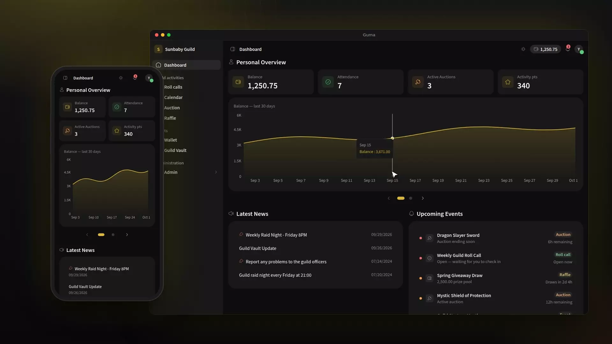
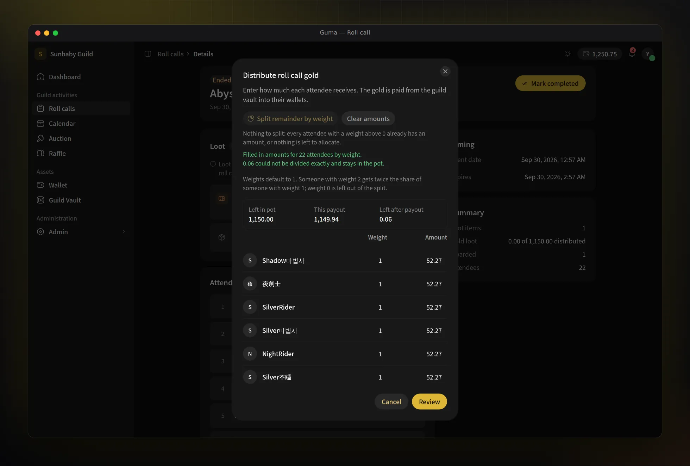
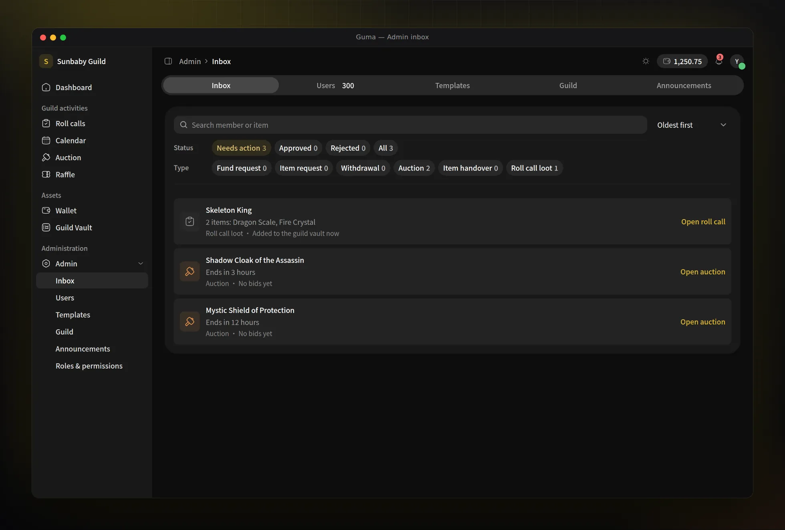

# Guma

Guma is a guild management app for online game guilds. Officers open roll calls
for boss fights, members check in, and the loot and gold from each fight flow
into a shared guild vault, member wallets, auctions, and raffles, with every
movement recorded. Members sign in with Discord, and the app is available in
English and Traditional Chinese.



<p align="center"><sub>Also available as a <a href="docs/demo.mp4">1080p video (MP4)</a>.</sub></p>

To try Guma without a backend, run `make web-demo` for a static demo on mock
data with a role picker instead of Discord login. See [docs/demo.md](docs/demo.md).

## Features

- **Roll calls**: officers open a roll call for a boss or event, members check
  in, and the loot and gold pot are distributed to attendees.
- **Boss calendar**: month, week, and day views with recurring events.
- **Auctions and raffles**: members bid with their wallet balance or buy raffle
  tickets for a spinning draw.
- **Wallet, backpack, and guild vault**: balances, transfers, withdrawals,
  items, and shared guild funds, each with a full history.
- **Administration**: one inbox for requests and approvals, member roles,
  templates, announcements, and guild settings.
- **Across the app**: live updates over server-sent events, notifications,
  light and dark themes, keyboard shortcuts, and a mobile layout.

| Roll call gold distribution | Admin inbox |
| --- | --- |
|  |  |

## Architecture

- **Frontend** (`web/`): Next.js 16, React 19, HeroUI v3, Tailwind CSS v4, and
  `next-intl`, on `:3000`.
- **Backend**: a single Go binary (`guma serve`) with gRPC on `:50051` and an
  HTTP/JSON gateway on `:8080`.
- **Data and auth**: PostgreSQL through `pgx` and `sqlc`; Ory Kratos for Discord
  login.

[AGENTS.md](AGENTS.md) has the repository map, conventions, and commands.

## Getting started

Requirements: Docker and the
[Dev Container CLI](https://github.com/devcontainers/cli), plus a Discord OAuth
application for real sign-in (frontend-only work can use mock mode, see
[web/README.md](web/README.md)).

```bash
cp .devcontainer/config/kratos/kratos.yaml.example .devcontainer/config/kratos/kratos.yaml
cp config.yaml.example config.yaml
# add your Discord client ID and secret to kratos.yaml, then:
make devcontainer
```

Open <http://localhost:8081>. nginx serves the frontend, the API, and the
Kratos flows from one origin. Never commit `config.yaml`, `kratos.yaml`, or
`.env` files.

Common commands:

```bash
go test ./...                       # backend tests
cd web && npm run lint              # frontend lint
cd web && npx next build --webpack  # frontend production build
make proto                          # after editing proto/guma/v1/*.proto
make sqlc                           # after editing internal/db/queries/*.sql
```

Migrations, devcontainer logs, and the full command list are in
[AGENTS.md](AGENTS.md).

## Deployment

The backend image is built from the root [dockerfile](dockerfile), and
[deploy/guma](deploy/guma) contains a Helm chart; review its `values.yaml`
before deploying. OpenTelemetry metrics and tracing are off by default; see the
`metrics` and `tracing` sections of [config.yaml.example](config.yaml.example).

## Contributing

See [CONTRIBUTING.md](CONTRIBUTING.md).

## License

Copyright (C) 2026 K1a

Guma is licensed under the [Elastic License 2.0](LICENSE) (Elastic-2.0), a
source-available license. Guilds may use, self-host, and modify it for free,
but it may not be offered to third parties as a hosted or managed service.
